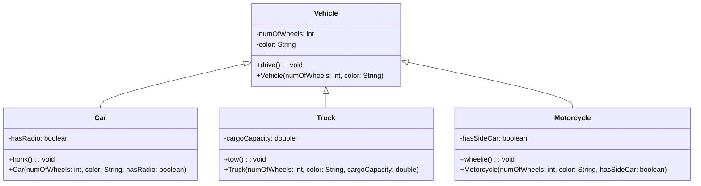

# inheritance

Inheritance is a core feature of object-oriented programming that allows a class to inherit properties and behaviors from another class. In Java, we can create a new class that is derived from an existing class by using the "extends" keyword. The class that is being inherited from is called the superclass or parent class, while the class that inherits from it is called the subclass or child class. [1]

There are several types of inheritance in Java:

- Single inheritance: A subclass can inherit from only one superclass.
- Multilevel inheritance: A subclass can inherit from a superclass, which in turn can inherit from another superclass.
- Hierarchical inheritance: Multiple subclasses can inherit from the same superclass.
- Multiple inheritance: A subclass can inherit from multiple superclasses, but Java does not support multiple inheritance of classes (although it does support multiple inheritance of interfaces). [2]
- Hybrid class inheritance: A combination of multiple and hierarchical inheritance.


## example




The example defines four classes: Vehicle, Car, Truck, and Motorcycle. Car, Truck, and Motorcycle all inherit from Vehicle, which serves as the superclass. Vehicle has two properties, numOfWheels and color, and a method drive() that prints "Driving..." to the console.

Car has an additional property, hasRadio, and a method honk() that prints "Honking..." to the console. Truck has an additional property, cargoCapacity, and a method tow() that prints "Towing..." to the console. Motorcycle has an additional property, hasSideCar, and a method wheelie() that prints "Doing a wheelie..." to the console.

Each subclass has its own constructor that calls the constructor of the superclass to initialize the inherited properties. The example shows how inheritance allows us to define a general Vehicle class and then define more specific classes Car, Truck, and Motorcycle that inherit from Vehicle and add their own properties and methods. This approach promotes code reuse and makes it easier to manage the codebase.


```java
// Vehicle class
class Vehicle {
    // Properties
    int numOfWheels;
    String color;
    
    // Constructor
    Vehicle(int numOfWheels, String color) {
        this.numOfWheels = numOfWheels;
        this.color = color;
    }
    
    // Methods
    void drive() {
        System.out.println("Driving...");
    }
}

// Car class (inherits from Vehicle)
class Car extends Vehicle {
    // Properties
    boolean hasRadio;
    
    // Constructor
    Car(int numOfWheels, String color, boolean hasRadio) {
        // Call the parent constructor to initialize the inherited properties
        super(numOfWheels, color);
        
        this.hasRadio = hasRadio;
    }
    
    // Methods
    void honk() {
        System.out.println("Honking...");
    }
}

// Truck class (inherits from Vehicle)
class Truck extends Vehicle {
    // Properties
    int cargoCapacity;
    
    // Constructor
    Truck(int numOfWheels, String color, int cargoCapacity) {
        // Call the parent constructor to initialize the inherited properties
        super(numOfWheels, color);
        
        this.cargoCapacity = cargoCapacity;
    }
    
    // Methods
    void tow() {
        System.out.println("Towing...");
    }
}

// Motorcycle class (inherits from Vehicle)
class Motorcycle extends Vehicle {
    // Properties
    boolean hasSideCar;
    
    // Constructor
    Motorcycle(int numOfWheels, String color, boolean hasSideCar) {
        // Call the parent constructor to initialize the inherited properties
        super(numOfWheels, color);
        
        this.hasSideCar = hasSideCar;
    }
    
    // Methods
    void wheelie() {
        System.out.println("Doing a wheelie...");
    }
}

```


## resources:

Accessed 03/03/2023.

[1] : [Introduction of Object Oriented Programming - GeeksforGeeks.](https://www.geeksforgeeks.org/introduction-of-object-oriented-programming/)

[2] : [Multiple Inheritance of State, Implementation, and Type](https://docs.oracle.com/javase/tutorial/java/IandI/multipleinheritance.html)

## 